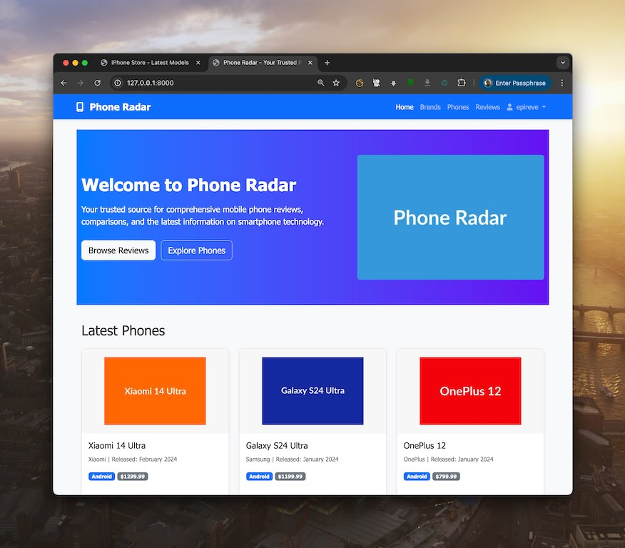
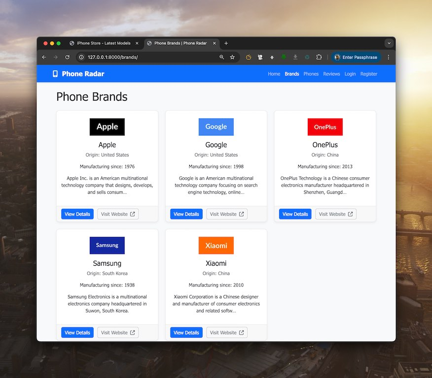
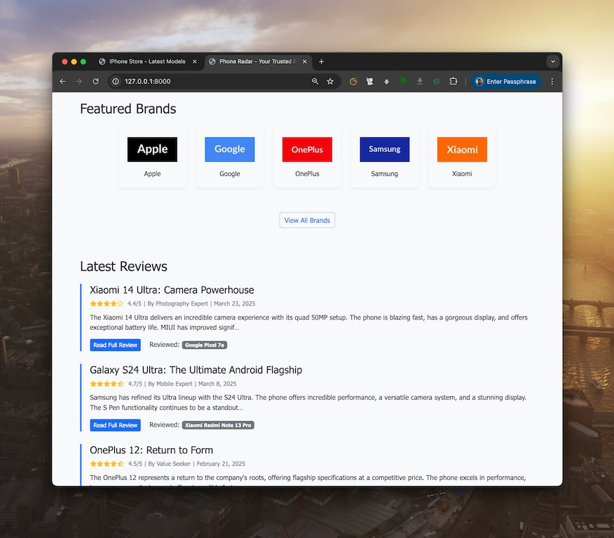
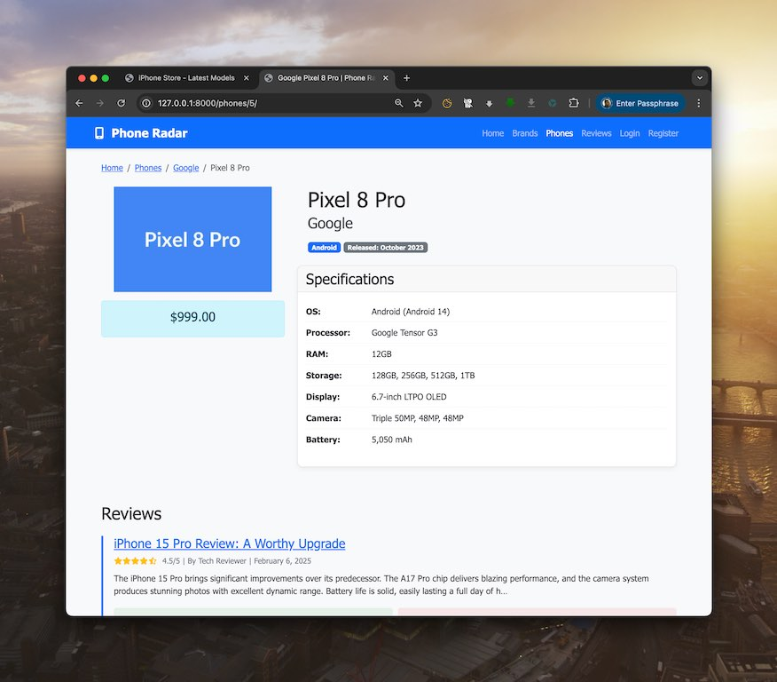
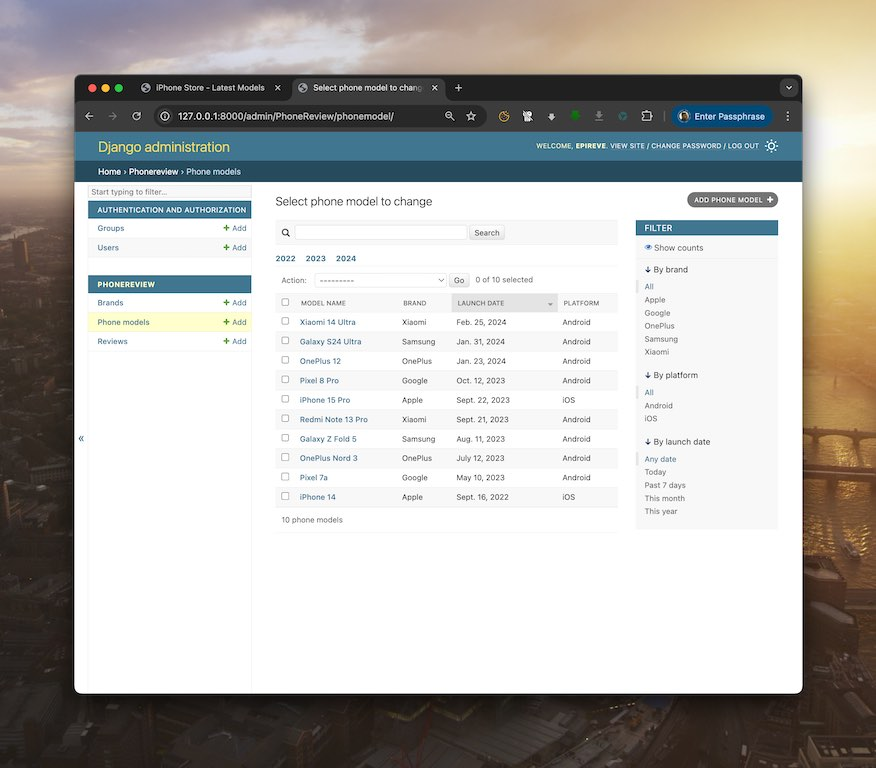
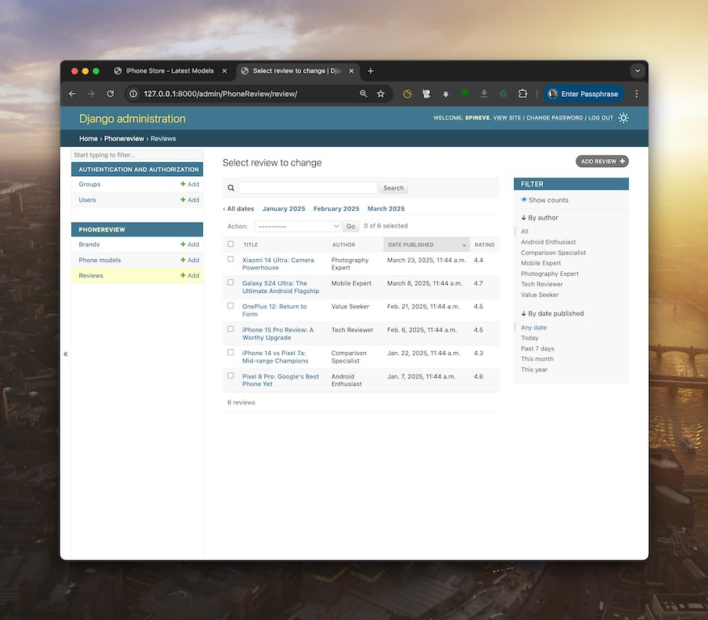
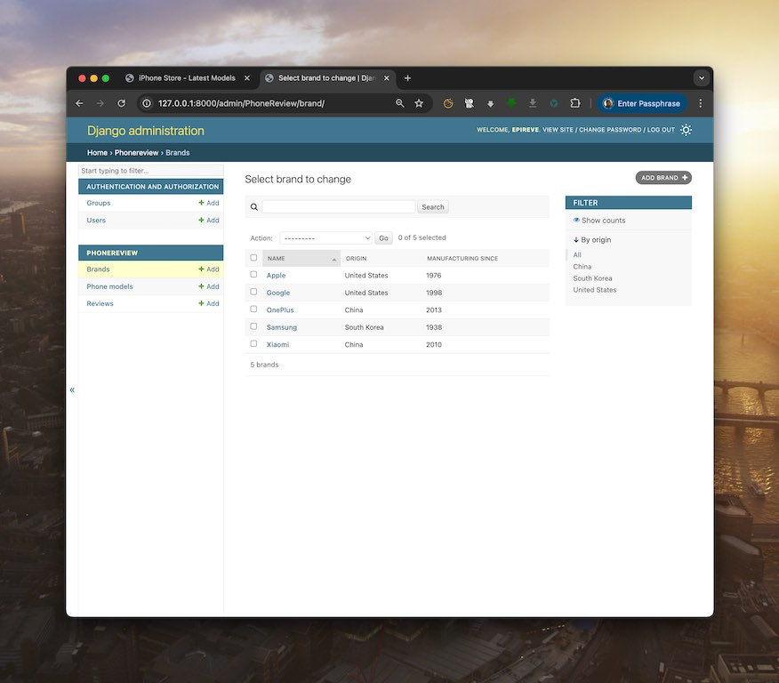

# PhoneRadar Project

## Project Overview
Django-based mobile phone review aggregator with brand/model tracking and user reviews

## Features
- Brand catalog
- Phone model comparisons
- User review system
- Admin management

## Screenshots

### Web Application Views

### Admin Interface

## Setup Instructions
1. Clone repository
2. Run `pip install -r requirements.txt`
3. Apply migrations: `python manage.py migrate`
4. Start server: `python manage.py runserver`