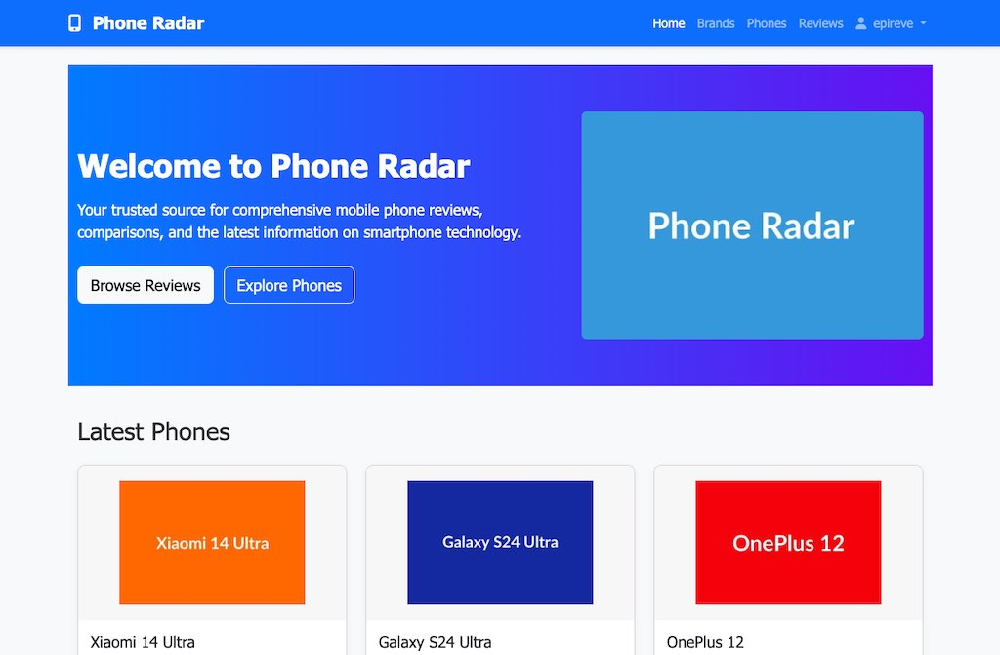
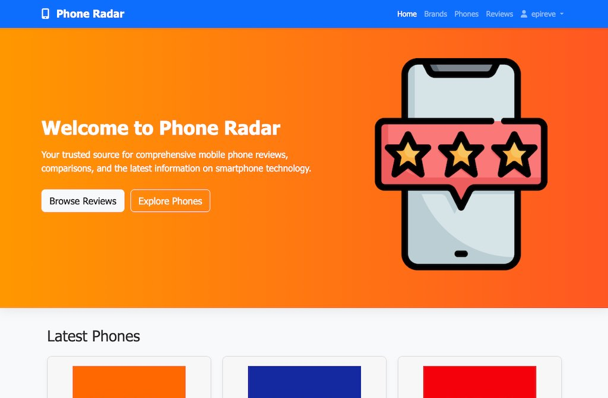
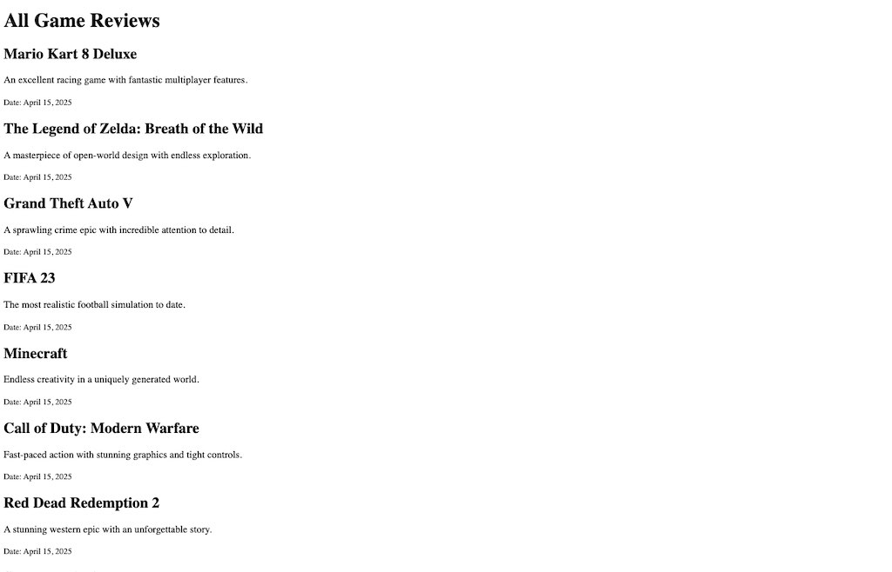
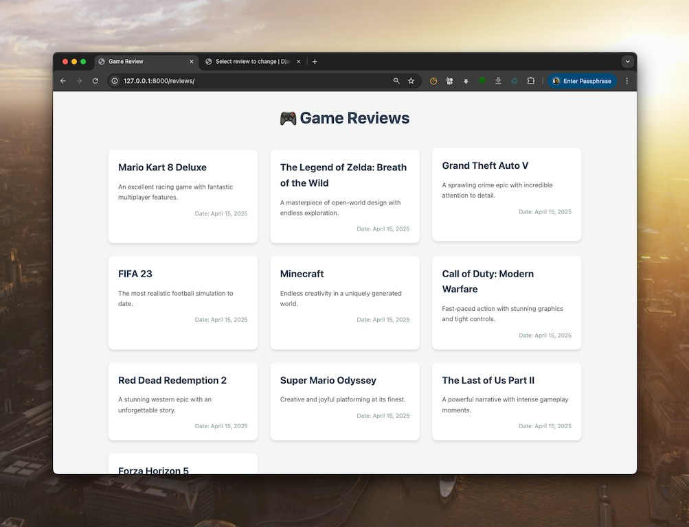
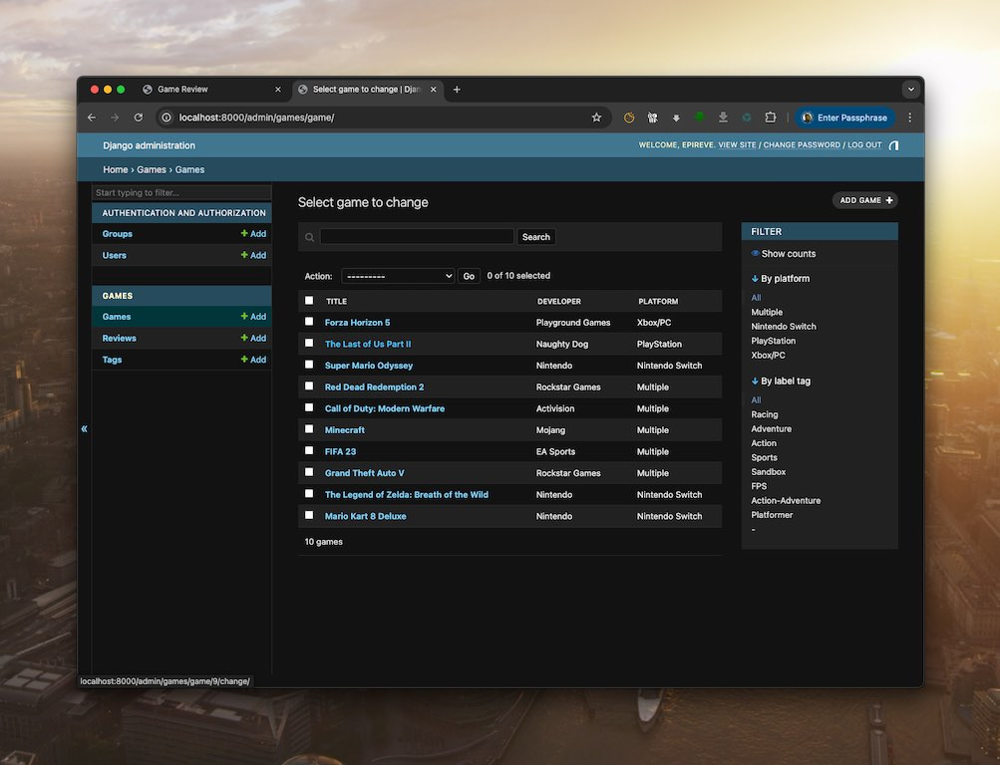
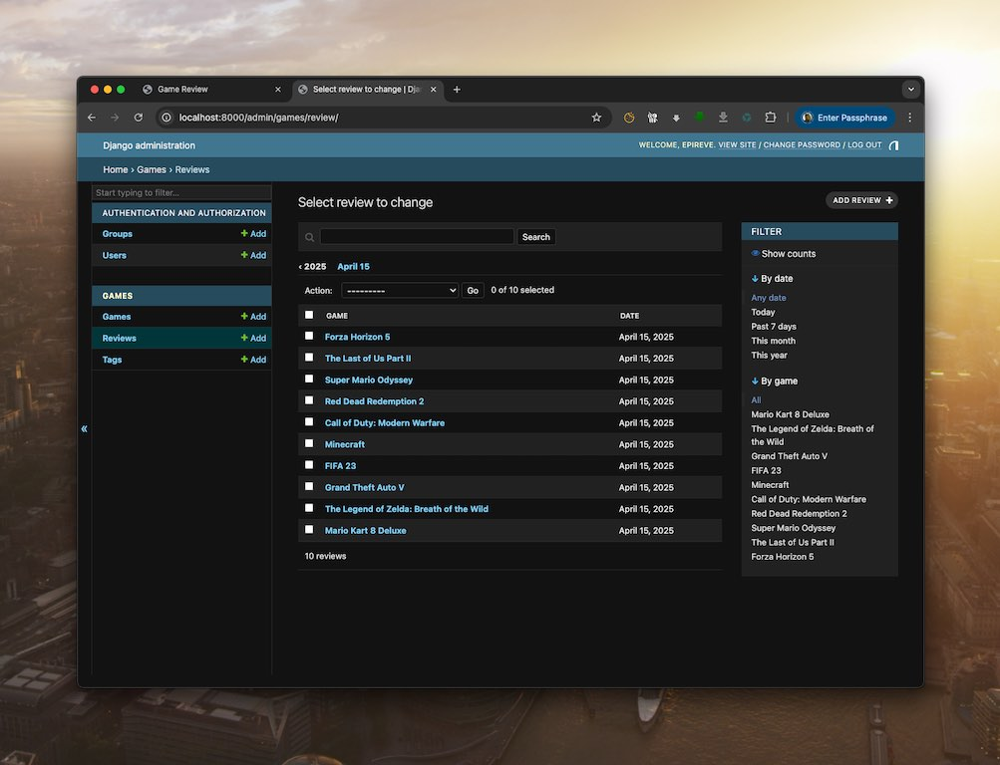

# Week 5: Django Web Development Journey

This week's tutorial consists of two parts: enhancing the PhoneRadar project and creating a new Game Reviews platform.

## Part A: PhoneRadar Enhancement 📱

### Hero Section Update
We improved the PhoneRadar project's homepage by updating its hero section for better user engagement.

**Before the Update:**

- Basic hero section
- Standard layout
- Limited visual appeal

**After the Update:**

- Enhanced visual design
- Improved user experience
- More engaging hero section

## Part B: Game Reviews Platform 🎮

In this section, we built a new Django application for game reviews using Class-Based Views, demonstrating the evolution from basic functionality to a polished web interface.

### 1. Initial Implementation
Our journey began with a basic, unstyled implementation of the game reviews page:

- Basic HTML structure
- Raw data display
- Functional but minimal design

### 2. Enhanced User Interface
We transformed the basic page with modern CSS styling:

- Responsive grid layout
- Card-based design with hover effects
- Professional typography and spacing
- Subtle shadows and rounded corners
- Cohesive color scheme

### 3. Game Management Interface
The admin interface provides comprehensive game management:

- Detailed game information management
- Tag-based categorization
- Intuitive admin controls
- Advanced filtering capabilities

### 4. Review Management System
A robust system for managing game reviews:

- Streamlined review creation
- Chronological tracking
- Efficient filtering and search
- User-friendly interface

## Technical Implementation

### Models Structure
```python
class Game:
    - title
    - developer
    - platform
    - label_tag (M2M with Tags)
    - slug

class Review:
    - game (FK to Game)
    - review
    - date
    - slug

class Tags:
    - label
```

### Key Features
- Django Class-Based Views
- Responsive CSS Grid design
- Custom Django Admin interface
- Related model architecture
- Modern UI/UX practices

## Learning Outcomes
1. Class-Based Views implementation
2. Advanced Django template usage
3. CSS Grid and modern styling
4. Django Admin customization
5. Database relationships
6. User interface design principles

## Setup Instructions
1. Create and activate virtual environment:
   ```bash
   python -m venv .venv
   source .venv/bin/activate
   ```
2. Install dependencies:
   ```bash
   pip install django
   ```
3. Apply migrations:
   ```bash
   python manage.py migrate
   ```
4. Run development server:
   ```bash
   python manage.py runserver
   ```

## Future Enhancements
- User authentication system
- Rating and scoring system
- Image upload for games
- User profiles
- Advanced search functionality
- API endpoints

---
*This project demonstrates the progression from basic Django functionality to a fully-featured web application, covering both frontend and backend development aspects.*