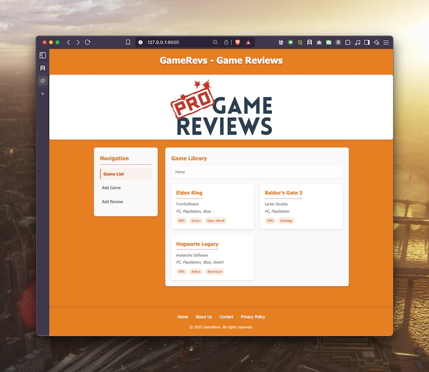
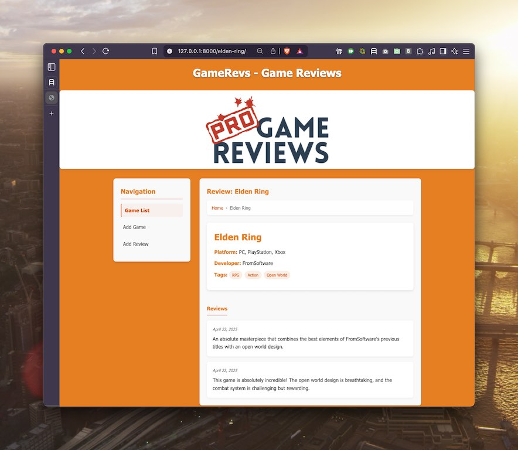
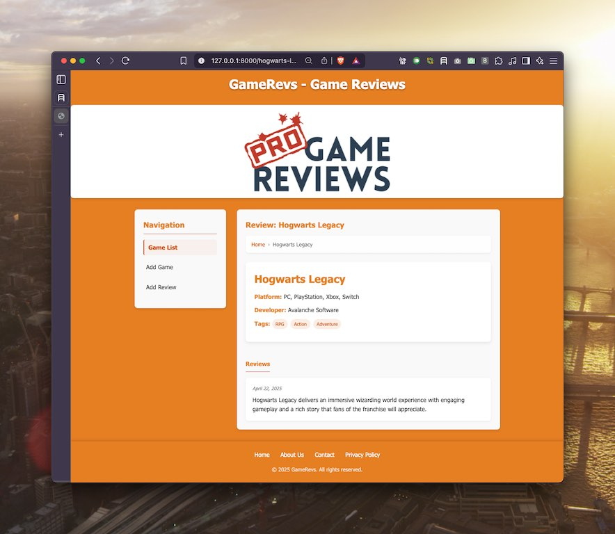
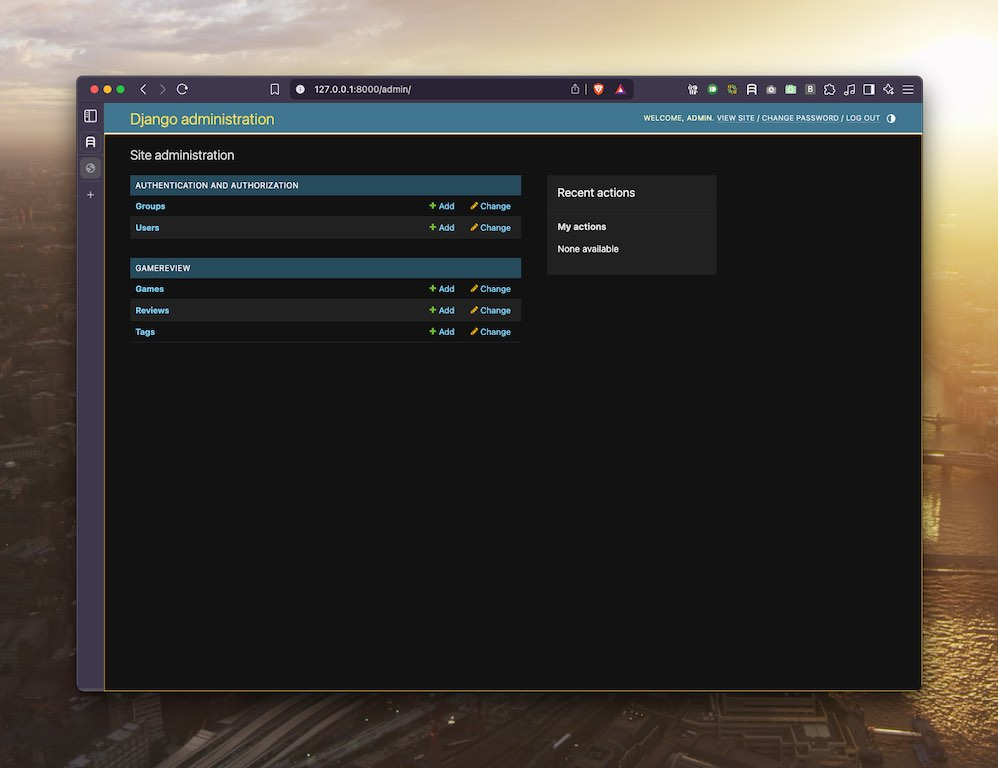
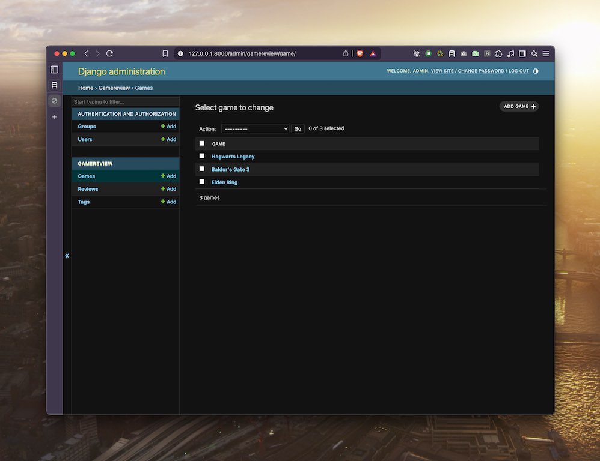
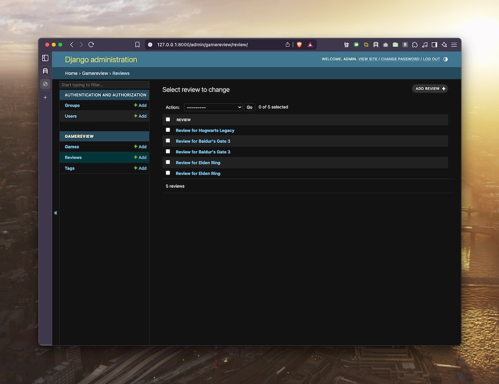
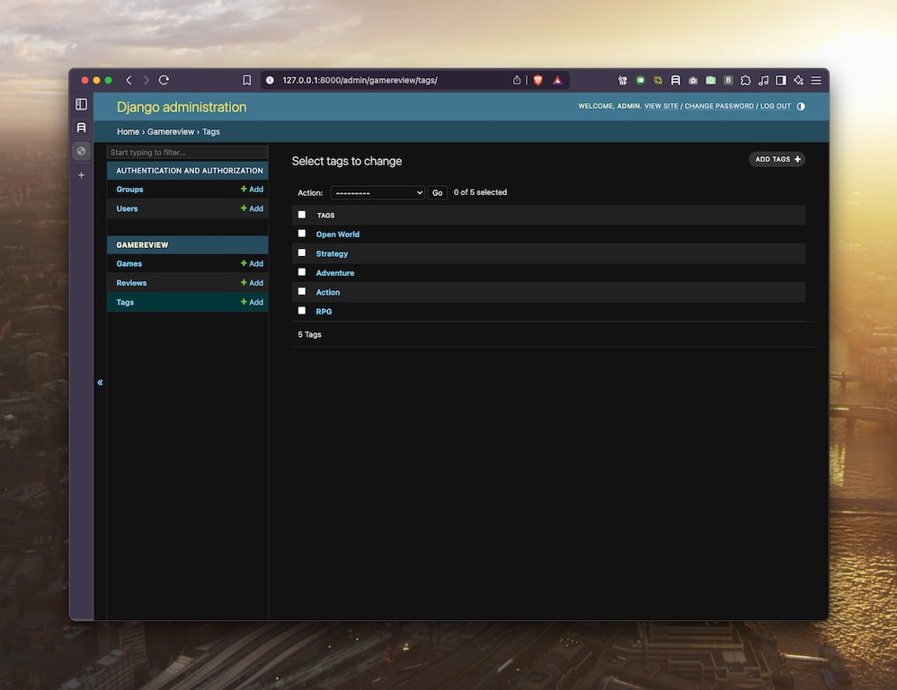

# Week 6: Enhanced Game Reviews Platform

This week's project builds upon the game reviews platform from week 5, adding significant UI/UX improvements and functionality enhancements.

## Project Overview 🎮

The GameRevs application is a Django-based game reviews platform that allows users to browse games, read reviews, and navigate through different sections of the site with an improved user experience.

## Key Enhancements

### 1. Modern UI Overhaul
We've completely redesigned the user interface with:


*The homepage showcases our orange-themed design with a responsive card layout for games.*

- **Responsive design** that adapts to different screen sizes
- **Modern color scheme** with an orange theme
- **Card-based layout** for game listings
- **Visual hierarchy** through typography, spacing, and color
- **Hover effects** and subtle animations for better interactivity

### 2. Breadcrumb Navigation
Added intuitive breadcrumb navigation to help users:


*The Elden Ring detail page features breadcrumb navigation for easy navigation back to the home page.*

- Track their location within the site
- Easily navigate back to previous pages
- Understand the site structure
- Experience improved usability

### 3. Enhanced Content Display
Improved the way game information and reviews are presented:


*The Hogwarts Legacy page shows structured game details and chronologically ordered reviews with dates.*

- **Tag system** with visual styling for game categories
- **Structured game details** with clear labels for platform and developer
- **Chronological review display** with dates
- **Empty state handling** for games without reviews

### 4. Admin Interface
The Django admin interface provides comprehensive management tools:


*The Django admin dashboard gives administrators full control over the site content.*

- User and permissions management
- Complete game and review administration
- Tag management for categorization
- Clean, intuitive interface

### 5. Game Management
Robust tools for managing game data:


*The game management interface allows administrators to view and modify all games in the system.*

- List view of all games with selection capabilities
- Batch operations for multiple games
- Quick access to add new games
- Filtering and search functionality

### 6. Review Management
Comprehensive review administration:


*The review management interface shows all reviews organized by game.*

- All reviews accessible in one place
- Game-based organization
- Ability to add, edit, or remove reviews
- Batch operations for efficient management

### 7. Tag System
Flexible tag management for game categorization:


*The tag management system allows for easy categorization of games by genre and features.*

- Genre-based categorization (RPG, Action, Adventure, etc.)
- Feature-based tags (Open World, Strategy)
- Easy addition and modification of tags
- Association with games for improved filtering

## Technical Implementation

### Models Structure
```python
class Game:
    - title
    - developer
    - platform
    - label_tag (M2M with Tags)
    - slug

class Review:
    - game (FK to Game)
    - review
    - date
    - slug

class Tags:
    - label
```

### CSS Improvements
- **CSS Variables** for consistent theming
- **Flexbox and Grid** layouts for modern design
- **Responsive breakpoints** for mobile compatibility
- **Animation keyframes** for subtle motion effects
- **Organized CSS structure** with clear comments

### Template Enhancements
- Improved semantic HTML structure
- Django template inheritance for consistent layouts
- Context-aware navigation with breadcrumbs
- Conditional rendering for empty states

## Running the Project

1. Create and activate virtual environment:
   ```bash
   python -m venv .venv
   source .venv/bin/activate
   ```

2. Install dependencies:
   ```bash
   pip install django
   ```

3. Apply migrations:
   ```bash
   python manage.py migrate
   ```

4. Load sample data:
   ```bash
   python manage.py load_sample_data
   ```

5. Run development server:
   ```bash
   python run_django.py
   ```

6. Visit http://localhost:8000 in your browser

## Design Principles Applied

1. **Visual Hierarchy** - Important elements stand out through size, color, and placement
2. **Consistency** - Uniform styling across all pages
3. **Feedback** - Visual cues for interactive elements
4. **Accessibility** - Clear contrast and readable typography
5. **Progressive Disclosure** - Information presented in a digestible way

## Learning Outcomes

- Advanced CSS techniques including variables, animations, and responsive design
- Improved Django templating with conditional rendering
- User experience design principles
- Navigation patterns like breadcrumbs
- Visual design fundamentals including color theory and typography

## Future Enhancement Ideas

- User authentication and personal review creation
- Rating system with star visualizations
- Game image uploads and galleries
- Search functionality with filters
- Dark mode toggle
- Related games suggestions

---
*This project demonstrates a significant advancement in front-end design skills while maintaining the robust Django backend structure.* 